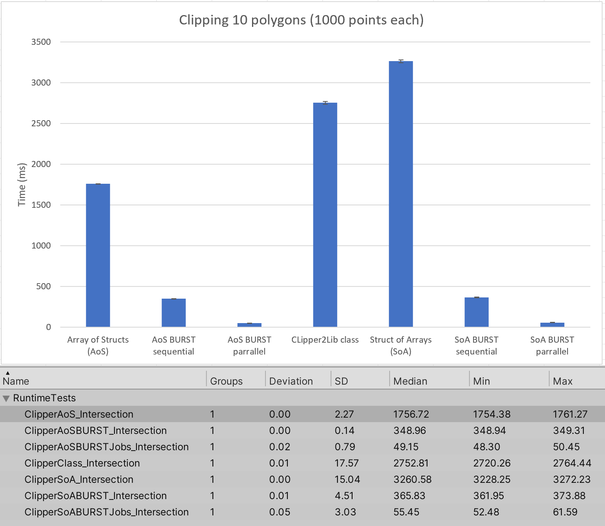

# ClipperDOTSStressTest
 Struct conversion of [Clipper2Lib](https://github.com/AngusJohnson/Clipper2)
 (forked from https://github.com/AngusJohnson/Clipper2) to make it compatible
 with [BURST](https://docs.unity3d.com/Packages/com.unity.burst@1.7/manual/index.html) 
and [Job](https://docs.unity3d.com/Manual/JobSystem.html) system.

-Open in Unity 2022.3.7f or later https://unity.com/releases/editor/whats-new/2022.3.7

-Run Benchmarks: 

    -Window-->General-->Test Runner--Run Tests
    -Window-->Analysis-->Performance Test Report

Or 

    --open StressTest.scene, 
    --Open "New SubScene"
    --open profiler (CTRL+F7)
    --select one of the bechmarks under "Clipper Test Type", 
    --hit play

